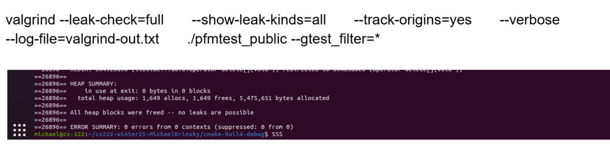

## Debugger and Valgrind Report

### 1. Basic information
- Team #: 10
- Github Repo Link: https://github.com/MichaelKrinsky/cs222-winter25-MichaelKrinsky
- Student 1 UCI NetID: makrinsk
- Student 1 Name: Michael Krinsky
- Student 2 UCI NetID (if applicable): NA
- Student 2 Name (if applicable): NA

### 2. Using a Debugger
- Describe how you use a debugger (gdb, or lldb, or CLion debugger) to debug your code and show screenshots. 
For example, using breakpoints, step in/step out/step over, evaluate expressions, etc. 

I didn't use a debugger. I prefer to suffer with std::cout instead.
### 3. Using Valgrind
- Describe how you use Valgrind to detect memory leaks and other problems in your code and show screenshot of the Valgrind report.

 I spent 4 hours trying to get valgrind to run on my windows machine, then another 2 getting my entire dev setup on a virtualbox machine to run it once and find I didn't have any memory leaks because I didn't use any. 

The Commands I used:
valgrind --leak-check=full       --show-leak-kinds=all       --track-origins=yes       --verbose       --log-file=valgrind-out.txt       ./pfmtest_public --gtest_filter=*
valgrind --leak-check=full       --show-leak-kinds=all       --track-origins=yes       --verbose       --log-file=valgrind-out.txt       ./rbfmtest_public --gtest_filter=*

RBFM Test:
 THe RBFM tests had 1 error due to a test case that I had segfaulting, but I was unable to solve it. No leaks tho :)
==8022==
==8022== HEAP SUMMARY:
==8022==     in use at exit: 0 bytes in 0 blocks
==8022==   total heap usage: 1,649 allocs, 1,649 frees, 5,475,651 bytes allocated
==8022==
==8022== All heap blocks were freed -- no leaks are possible
==8022==
==8022== ERROR SUMMARY: 1 errors from 1 contexts (suppressed: 0 from 0)
==8022==
==8022== 1 errors in context 1 of 1:
==8022== Syscall param read(buf) points to unaddressable byte(s)
==8022==    at 0x4CDA1F2: read (read.c:26)
==8022==    by 0x4C5B307: _IO_file_xsgetn (fileops.c:1342)
==8022==    by 0x4C4EEE2: fread (iofread.c:38)
==8022==    by 0x1FF19D: PeterDB::FileHandle::readPage(unsigned int, void*) (in /home/michael/cs222-winter25-MichaelKrinsky/cmake-build-debug/pfmtest_public)
==8022==    by 0x19A18D: PeterDBTesting::PFM_Page_Test_read_nonexistent_page_Test::TestBody() (in /home/michael/cs222-winter25-MichaelKrinsky/cmake-build-debug/pfmtest_public)
==8022==    by 0x1EABD5: void testing::internal::HandleSehExceptionsInMethodIfSupported<testing::Test, void>(testing::Test*, void (testing::Test::*)(), char const*) (in /home/michael/cs222-winter25-MichaelKrinsky/cmake-build-debug/pfmtest_public)
==8022==    by 0x1E3128: void testing::internal::HandleExceptionsInMethodIfSupported<testing::Test, void>(testing::Test*, void (testing::Test::*)(), char const*) (in /home/michael/cs222-winter25-MichaelKrinsky/cmake-build-debug/pfmtest_public)
==8022==    by 0x1B88C1: testing::Test::Run() (in /home/michael/cs222-winter25-MichaelKrinsky/cmake-build-debug/pfmtest_public)
==8022==    by 0x1B9303: testing::TestInfo::Run() (in /home/michael/cs222-winter25-MichaelKrinsky/cmake-build-debug/pfmtest_public)
==8022==    by 0x1B9C00: testing::TestSuite::Run() (in /home/michael/cs222-winter25-MichaelKrinsky/cmake-build-debug/pfmtest_public)
==8022==    by 0x1C9592: testing::internal::UnitTestImpl::RunAllTests() (in /home/michael/cs222-winter25-MichaelKrinsky/cmake-build-debug/pfmtest_public)
==8022==    by 0x1EC103: bool testing::internal::HandleSehExceptionsInMethodIfSupported<testing::internal::UnitTestImpl, bool>(testing::internal::UnitTestImpl*, bool (testing::internal::UnitTestImpl::*)(), char const*) (in /home/michael/cs222-winter25-MichaelKrinsky/cmake-build-debug/pfmtest_public)
==8022==  Address 0x0 is not stack'd, malloc'd or (recently) free'd
==8022==
==8022== ERROR SUMMARY: 1 errors from 1 contexts (suppressed: 0 from 0)
